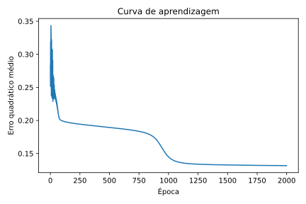
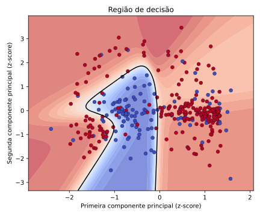

# Projeto de rede neural

**Disciplina:** Matemática para Ciência de Dados  
**Curso:** Especialização em Deep Learning  
**Instituição:** CIn - Centro de Informática - UFPE  
**Aluno:** João Pedro da Silva Rodrigues

## Sobre o projeto

Este projeto visa implementação de uma rede neural manualmente. Desse modo, para validar a implementação manual de uma rede neural com retropropagação, a rede é treinada em um conjunto de dados real, e os seus resultados são comparados com os de uma rede equivalente construída em Keras.

## Escolha da base

A [Ionosphere](https://archive.ics.uci.edu/dataset/52/ionosphere) contém 351 sinais coletados por 16 antenas de radar em Goose Bay, Labrador. Seus 34 atributos contínuos descrevem os sinais; retornos `good` indicam estrutura na ionosfera e retornos `bad` atravessam a ionosfera. Na projeção bidimensional, a sobreposição das classes exige uma fronteira curva.

Os quatro neurônios de cada camada oferecem flexibilidade à fronteira e mantêm a rede compacta.

Para permitir a plotagem da fronteira de decisão, realizou-se a redução dos 34 atributos para duas componentes por PCA. Além disso, os dados de entrada foram normalizados usando z-score, evitando que uma das features tenha mais peso do que a outra.

Para o projeto, adotou-se uma taxa adaptativa, que começa em `10` e diminui por `10 / (1 + 0,001 × época)`. O valor inicial compensa os gradientes pequenos das camadas sigmoides, enquanto a redução gradual estabiliza o treinamento e favorece a convergência em 2.000 épocas.

## Como executar

### Windows

```powershell
python -m venv .venv
.\.venv\Scripts\Activate.ps1
python -m pip install -r requirements.txt
python projeto_rede_neural.py
jupyter notebook relatorio_tecnico.ipynb
```

### Linux

```bash
python3 -m venv .venv
source .venv/bin/activate
python -m pip install -r requirements.txt
python projeto_rede_neural.py
jupyter notebook relatorio_tecnico.ipynb
```

O script treina as redes e salva `resultados_rede.npz`. No notebook, execute todas as células para gerar os gráficos.

## Resultados

- acurácia antes do treinamento: 64,10%;
- acurácia da rede manual: 84,33%;
- acurácia da rede Keras: 84,33%.





## Arquivos

- `projeto_rede_neural.py`: rotina de código principal para o treinamento da rede neural com a implementação manual e com o Keras;
- `dados_ionosphere/`: base e descrição originais da UCI;
- `figuras/`: gráficos e diagramas da rede;
- `relatorio_tecnico.ipynb`: relatório com detalhes técnicos da implementação e justificativas das escolhas do projeto;
- `requirements.txt`: dependências do projeto.
